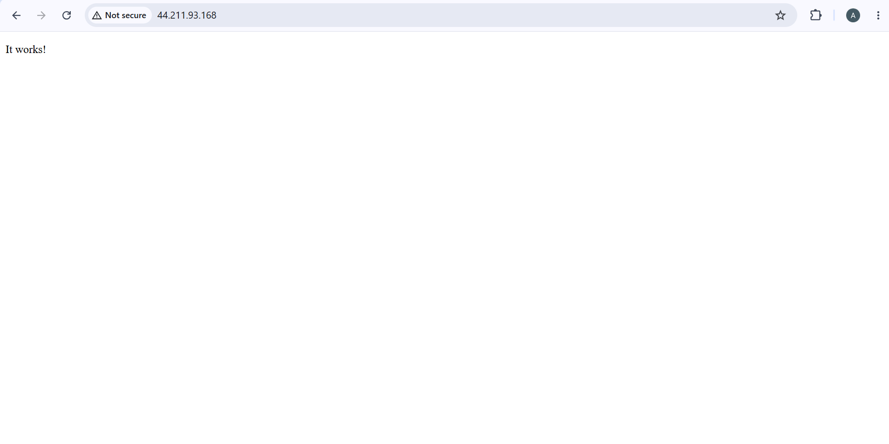

# AWS Cloud Home Lab — Project 1: Custom VPC with Public Web Server

**Author:** Adil Majeed
**Date:** August 2026
**Goal:** Build and deploy a secured, internet-accessible web server on AWS from scratch, using a custom-built network (not the AWS default VPC), to demonstrate practical AWS networking and security fundamentals.

## Overview

This project is a hands-on foundation exercise for cloud networking and cloud security. Instead of using AWS's pre-built default VPC, every networking component was created manually to build a real understanding of how traffic flows into a cloud environment — and how to control that flow securely.

The end result: a live EC2 web server, reachable from anywhere on the internet over HTTP, while administrative (SSH) access remains restricted to a single trusted IP address.

## Architecture

```
Internet
   │
   ▼
Internet Gateway (IGW)
   │
   ▼
Route Table  ──  0.0.0.0/0 → IGW   (routes internet-bound traffic out)
   │
   ▼
Public Subnet (10.10.2.0/24)
   │
   ▼
Security Group
   ├── Inbound: HTTP (port 80)  → 0.0.0.0/0        (open to everyone — public website access)
   └── Inbound: SSH  (port 22)  → my IP only        (locked down — admin access only)
   │
   ▼
EC2 Instance (Amazon Linux 2023, t3.micro)
   └── Apache (httpd) web server — serving the page publicly
```

## What Was Built

1. **Custom VPC** — an isolated virtual network, built manually rather than using AWS's default.
2. **Public Subnet** — a subnet within the VPC with a defined CIDR block.
3. **Internet Gateway (IGW)** — attached to the VPC to allow traffic in and out of the internet.
4. **Route Table** — configured with a `0.0.0.0/0 → IGW` route and associated with the public subnet, so instances in it can reach (and be reached from) the internet.
5. **Security Group** — configured with least-privilege access:
   - SSH (port 22) restricted to a single trusted IP address only.
   - HTTP (port 80) opened to the public (`0.0.0.0/0`), since a website needs to be reachable by anyone.
6. **EC2 Instance** — an Amazon Linux 2023 (t3.micro) server launched inside the public subnet.
7. **Apache Web Server (httpd)** — installed and started on the instance via SSH, serving a live web page over the public internet.

## Security Notes

- SSH access is locked to a single IP address, not open to the world — reducing the attack surface for administrative access.
- Only the minimum required port (HTTP/80) is exposed publicly, following the principle of least privilege.
- Access was verified end-to-end: the web page loads successfully over HTTP from a browser, confirming the network path (Internet → IGW → Route Table → Subnet → Security Group → EC2) works correctly.

## Proof



*The Apache default page, loaded directly from the EC2 instance's public IP address, confirming the server is live and reachable from the internet.*

## Key Learnings

- How a VPC's networking components (subnet, IGW, route table, security group) work together to control and enable internet connectivity.
- How to apply least-privilege security practices to a live cloud environment (restricting admin access while allowing public service access).
- Practical, hands-on experience with AWS EC2, security groups, and basic Linux server administration (installing and running a web service).

## Next Steps

- Add a private subnet and a second EC2 instance with no public IP, to demonstrate a multi-tier (public/private) network architecture.
- Replace the default Apache page with a custom static page.
- Automate this setup using Infrastructure as Code (Terraform), rather than manual console steps.
